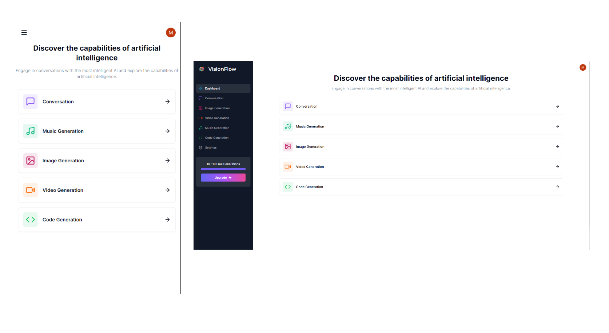

# SaaS AI Platform



Welcome to the SaaS AI Platform, a powerful and versatile AI-driven solution for various creative tasks. This platform is built with cutting-edge technologies and provides a range of features to enhance your development experience.

## Features

### Design and Styling

- **Tailwind Design:** Utilizes Tailwind CSS for a modern and clean design.
- **Tailwind Animations and Effects:** Includes dynamic animations and effects for an engaging user experience.
- **Full Responsiveness:** Ensures a seamless experience across devices of all sizes.

### Authentication

- **Clerk Authentication:** Supports multiple authentication methods, including email, Google, and 9+ social logins.

### Form Handling

- **Client Form Validation:** Implements form validation using `react-hook-form` for efficient and user-friendly data input.
- **Server Error Handling:** Utilizes `react-toast` for effective server error handling.

### AI Generation Tools

- **Image Generation Tool:** Integrates OpenAI for advanced image generation.
- **Video Generation Tool:** Utilizes Replicate AI for cutting-edge video generation.
- **Conversation Generation Tool:** Implements OpenAI for natural language conversation generation.
- **Music Generation Tool:** Leverages Replicate AI for innovative music generation.

### Additional Features

- **Page Loading State:** Provides feedback to users during page loading.
- **Stripe Monthly Subscription:** Integrates Stripe for secure and flexible monthly subscription management. (WIP)
- **Free Tier with API Limiting:** Offers a free tier with API limiting for different usage levels.

### Backend Development

- **Routes and Handlers:** Implements POST, DELETE, and GET routes in route handlers (`app/api`).
- **Direct Database Access:** Fetches data in server React components by directly accessing the database without an API.

### Frontend Development

- **Layout Reuse:** Maximizes code reusability with layout reuse strategies.
- **Server and Child Relational Components:** Develops server and child relational components for a well-organized codebase.

## Technologies Used

### Frontend

- Next.js
- React
- React DOM
- Tailwind CSS
- Axios
- Clerk
- React Hook Form
- OpenAI
- Replicate AI

### Backend

- Prisma
- Next.js API Routes

### Additional Tools

- Stripe
- Zod
- Zustand

## Getting Started

To get started with the SaaS AI Platform, follow these steps:

### Prerequisites

**Node version 20.x.x**

### Cloning the repository

```shell
git clone https://github.com/guacamoley/Fullstack-AI-Platform
```

### Install packages

```shell
npm i
```

### Setup .env file

```js
NEXT_PUBLIC_CLERK_PUBLISHABLE_KEY=
CLERK_SECRET_KEY=

NEXT_PUBLIC_CLERK_SIGN_IN_URL=/sign-in
NEXT_PUBLIC_CLERK_SIGN_UP_URL=/sign-up
NEXT_PUBLIC_CLERK_AFTER_SIGN_IN_URL=/dashboard
NEXT_PUBLIC_CLERK_AFTER_SIGN_UP_URL=/dashboard

OPENAI_API_KEY=
REPLICATE_API_TOKEN=

DATABASE_URL=

STRIPE_API_KEY=
STRIPE_WEBHOOK_SECRET=

NEXT_PUBLIC_APP_URL="http://localhost:3000"
```

### Setup MySQL

Add MySQL Database of your choice and update `DATABASE_URL`

### Running the app

```shell
npm run dev
```

Feel free to explore and customize the platform according to your needs!

## License

This project is licensed under the [MIT License](LICENSE).

---

Feel free to contribute, report issues, or reach out for support. Happy coding!
